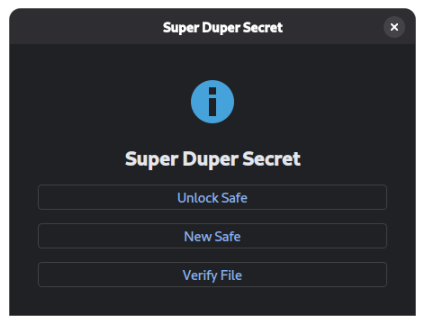

# SDS (Super Duper Secret)

| Startup | Passwords |
| :---: | :---: |
|  |  |

### Install:

Install using the latest release executable from the 'releases' section.

### Run Project in a Development Environment:

1. Your Python version must be `>=3.13.0`
2. Set up virtual environment(Inside the project directory): 
    - Linux: `python3 -m venv .venv`
    - Windows: `python -m venv .venv`
3. Activate virtual environment: 
    - Linux: `. .venv/bin/activate`
    - Windows: `.\.venv\Scripts\activate`
4. Setup package and dependencies: 
    - Linux: `pip install -e .`
    - Windows: `pip install -e .`
5. Run the project: 
    - Linux: `python src/main.py` 
    - Windows: `python src\main.py`
6. You can also compile the project to a binary executable:
    - `pyinstaller --onefile --windowed src/main.py`
    
### Project Map:

- `pyproject.toml` Contains metadata such as dependencies for the project.
- `assets/` Contains non-source-code files such as images for documentation.
- `src/` Contains source code for the project.
    - `src/core/` Contains the source code for core functionality such as encryption/hashing.
    - `src/ui/` Contains the source code for the GUI.
    - `src/main.py` Is the primary entry point (file that is executed to start the application).

