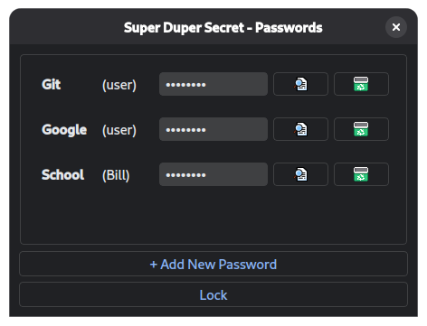
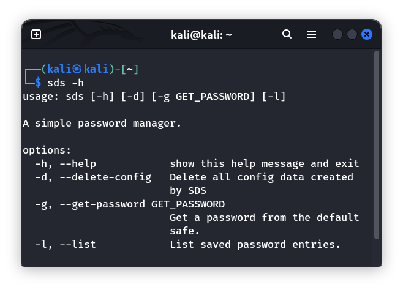
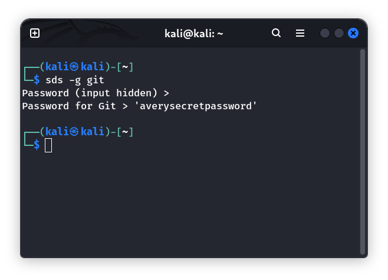

# SDS (Super Duper Secret)

| Startup | Passwords |
| :---: | :---: |
|  |  |
| CLI | Get Password |
|  |  |

### About:
This application was created for an undergraduate university security class project.

SDS is a simple, cross-platform password manager app written in Python. This app secures collections of passwords in encrypted password files.

**Features:**
- Store and manage passwords inside of encrypted databases.
- Verify downloaded files using the developer supplied hash.
- Graphical user interface powered by Qt6.
- Command line interface for shell based workflows.

### Install:

Download the latest release executable/package from the 'releases' section [here](https://github.com/ner216/sds/releases).

### Uninstall:

The program does create data folders when it is run. These are not deleted when the program is uninstalled. You can delete them with:

- Linux: `rm -rI ~/.config/SuperDuperSecret`
- Windows: remove the `C:\Users\<USERNAME>\AppData\Local\SuperDuperSecret` directory.

### Run Project in a Development Environment:

1. Your Python version must be `>=3.13.0`
2. Set up virtual environment(Inside the project directory): 
    - Linux: `python3 -m venv .venv`
    - Windows: `python -m venv .venv`
3. Activate virtual environment: 
    - Linux: `. .venv/bin/activate`
    - Windows: `.\.venv\Scripts\activate`
4. Setup package and dependencies: 
    - Linux: `pip install -e .`
    - Windows: `pip install -e .`
5. Run the project: 
    - Linux: `python src/main.py` 
    - Windows: `python src\main.py`
6. You can also compile the project to a binary executable:
    - `pyinstaller --onefile src/main.py`
    
### Building the RPM Package:
1. Compile the project using: `pyinstaller --onedir --noupx --name sds src/main.py`
2. Move into the `dist/` directory created by pyinstaller: `cd dist`
3. Rename the built directory: `mv sds sds-<version>`
4. Copy desktop file to the built directory: `cp ../packaging/sds.desktop sds-<version>`
5. Create `rpmbuild` directory: `mkdir -p ~/rpmbuild/{BUILD,RPMS,SOURCES,SPECS,SRPMS}`
6. Create tarball in the `rpmbuild` directory: 
`tar -czvf ~/rpmbuild/SOURCES/sds-<version>.tar.gz sds-<version>/`
7. Copy the spec file to `rpmbuild`: `cp ../packaging/sds.spec ~/rpmbuild/SPECS/`
8. Move to `rpmbuild`: `cd ~/rpmbuild`
9. Build the package: `rpmbuild -bb SPECS/sds.spec`
10. The newly created package will be located inside the `~/rpmbuild/RPMS/` directory.
    
### Project Map:

- `pyproject.toml` Contains metadata such as dependencies for the project.
- `assets/` Contains non-source-code files such as images for documentation.
- `packaging/` Contains resources needed for building the project as a Linux package.
- `src/` Contains source code for the project.
    - `src/core/` Contains the source code for core functionality such as encryption/hashing.
    - `src/ui/` Contains the source code for the GUI and CLI.
    - `src/utils/` Contains code used to perform external operations like manage config files.
    - `src/main.py` Is the primary entry point (file that is executed to start the application).
    
### Known Issues:
- CLI does not function on Windows as the program does not yet have a Windows installer.
- Currently, file hash verification only supports SHA256.

